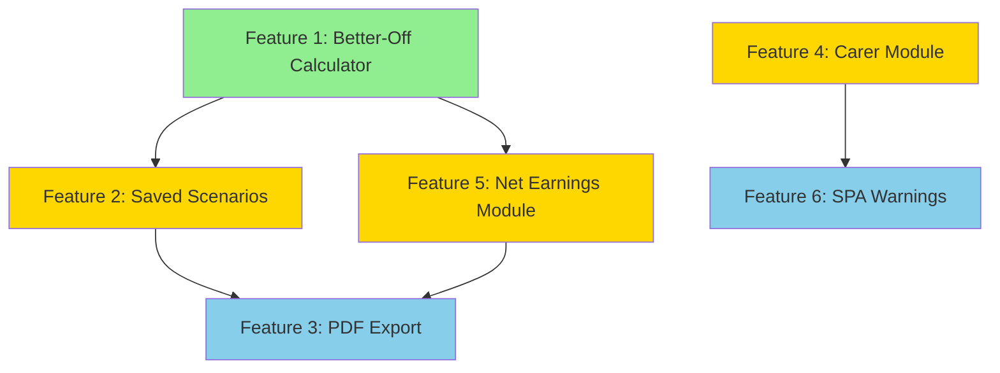

# CALCULATOR ENHANCEMENTS MIGRATION PLAN
## Migrating Features from better-off-calculator-test to calculator-Andrei

**Date:** November 11, 2025
**Source Repository:** https://github.com/PhilAgulnik/better-off-calculator-test
**Target Repository:** https://github.com/PhilAgulnik/calculator-Andrei

---

## TABLE OF CONTENTS

1. [Overview](#overview)
2. [Migration Strategy](#migration-strategy)
3. [Feature 1: Better-Off Calculator](#feature-1-better-off-calculator)
4. [Feature 2: Advanced Saved Scenarios](#feature-2-advanced-saved-scenarios)
5. [Feature 3: PDF Export](#feature-3-pdf-export)
6. [Feature 4: Dedicated Carer Module](#feature-4-dedicated-carer-module)
7. [Feature 5: Net Earnings Module](#feature-5-net-earnings-module)
8. [Feature 6: Enhanced State Pension Age Warnings](#feature-6-enhanced-state-pension-age-warnings)
9. [Feature 7: Child Benefit High Income Charge](#feature-7-child-benefit-high-income-charge)
10. [Implementation Order & Dependencies](#implementation-order--dependencies)
11. [Testing Strategy](#testing-strategy)
12. [Phase 4: Admin & Infrastructure Features](#phase-4-admin--infrastructure-features)
    - [Feature 8: Theme/Skin System](#feature-8-themeskin-system)
    - [Feature 9: Admin Panel](#feature-9-admin-panel)
    - [Feature 10: Text Manager System](#feature-10-text-manager-system)
    - [Feature 11: Password Protection](#feature-11-password-protection)
    - [Feature 12: Component Testing Tools](#feature-12-component-testing-tools)
13. [Document Usage](#document-usage)

---

## OVERVIEW

This document provides a structured plan for migrating calculator enhancement features from **better-off-calculator-test** (React/JavaScript/CRA) to **calculator-Andrei** (React/TypeScript/Vite/TanStack Router/Tailwind).

### Features to Migrate:

1. ✅ **Better-Off Calculator** - Scenario comparison tool (**COMPLETE**)
2. ✅ **Advanced Saved Scenarios** - Side-by-side comparison (**COMPLETE**)
3. ✅ **PDF Export** - Professional document generation (**COMPLETE**)
4. ✅ **Dedicated Carer Module** - Enhanced carer assessment (**COMPLETE**)
5. ✅ **Net Earnings Module** - Tax/NI breakdown calculator (**COMPLETE**)
6. ✅ **Enhanced State Pension Age Warnings** - Improved warnings with Pension Credit guidance (**COMPLETE**)
7. ✅ **Child Benefit High Income Charge** - Tax charge calculator for high earners (**COMPLETE**)

### Migration Approach:

- **Incremental**: Migrate one feature at a time to avoid token limits
- **Adapt**: Convert JavaScript → TypeScript, CSS → Tailwind, React Router → TanStack Router
- **Enhance**: Improve calculation accuracy where source has simplifications
- **Test**: Comprehensive testing for each feature before moving to next

---

## MIGRATION STRATEGY

### Technology Translation Matrix

| Aspect | better-off-calculator-test | calculator-Andrei | Translation Notes |
|--------|---------------------------|-------------------|-------------------|
| **Language** | JavaScript (JS/JSX) | TypeScript (TS/TSX) | Add type definitions, interfaces |
| **Styling** | CSS files, GOV.UK classes | Tailwind CSS 4.x | Convert CSS → Tailwind utilities |
| **Routing** | React Router (HashRouter) | TanStack Router | File-based routing, type-safe routes |
| **State** | useState, localStorage | useState, localStorage | Same patterns, add types |
| **Forms** | Controlled inputs | @tanstack/react-form | Use existing form patterns |
| **Components** | Custom components | Existing shared components | Reuse Button, Alert, Accordion, etc. |
| **Build** | Create React App | Vite | Faster builds, no config changes needed |

### File Organization in calculator-Andrei

```
src/
├── products/
│   └── benefits-calculator/
│       ├── components/          # Add new components here
│       │   ├── BetterOffCalculator.tsx        # Feature 1
│       │   ├── SavedScenariosComparison.tsx   # Feature 2
│       │   ├── PDFExport.tsx                  # Feature 3
│       │   ├── CarerModule.tsx                # Feature 4
│       │   ├── NetEarningsModule.tsx          # Feature 5
│       │   └── StatePensionAgeWarning.tsx     # Feature 6
│       ├── pages/               # Existing calculator pages
│       │   └── results.tsx      # Integrate new components here
│       └── utils/               # Existing calculator utilities
│           └── calculator.ts    # May need extensions
├── components/                  # Shared components
│   └── ...                      # Button, Alert, Form, etc.
└── utils/                       # Shared utilities
    └── formatters.ts            # Currency, date formatting
```

### Common Migration Steps (All Features)

1. **Analyze Source** - Study the component in better-off-calculator-test
2. **Create TypeScript Interfaces** - Define types for props, state, data structures
3. **Convert Component** - Translate JSX → TSX, add type annotations
4. **Migrate Styles** - Convert CSS classes → Tailwind utilities
5. **Integrate** - Add to appropriate page/route in calculator-Andrei
6. **Test** - Verify functionality, calculations, edge cases
7. **Document** - Update component docs, add JSDoc comments

---

## FEATURE 1: BETTER-OFF CALCULATOR

**Status:** ✅ COMPLETE - Successfully migrated and integrated
**Priority:** HIGH - Core calculator enhancement
**Complexity:** MEDIUM
**Actual Effort:** 6 hours

### 1.1 Overview

**What it does:**
Allows users to compare their current UC entitlement with a scenario where they work (or change work hours). Shows net benefit of taking employment.

**Key functionality:**
- Input work details (hours/week, hourly wage)
- Input additional costs of working (childcare, travel, etc.)
- Calculate net earnings after tax
- Calculate new UC amount with earnings
- Display "better off by" amount
- Show detailed cost breakdown

### 1.2 Source Files

**Location in better-off-calculator-test:**
```
src/features/uc-calculator/components/BetterOffCalculator.js
src/features/uc-calculator/components/BetterOffCalculator.css
```

**Key characteristics:**
- 400+ lines of JavaScript
- GOV.UK design system styling
- Expandable/collapsible sections
- 8 cost categories with 4 time period options each

### 1.3 Dependencies

**External packages needed:**
- None (pure React component)

**Internal dependencies:**
- `formatCurrency` utility (already exists in calculator-Andrei)
- Current UC amount from main calculator
- Work allowance rates (from calculator constants)
- Taper rate (55%)

### 1.4 Data Structures

**TypeScript Interfaces to Create:**

```typescript
// src/products/benefits-calculator/types/better-off-calculator.ts

interface WorkData {
  hours: number;
  wage: number;
  taxRate: number; // 0-100
}

interface CostData {
  childcare: { amount: number; period: 'week' | 'fortnight' | 'month' | 'year' };
  travel: { amount: number; period: 'week' | 'fortnight' | 'month' | 'year' };
  clothing: { amount: number; period: 'week' | 'fortnight' | 'month' | 'year' };
  meals: { amount: number; period: 'week' | 'fortnight' | 'month' | 'year' };
  otherCosts: { amount: number; period: 'week' | 'fortnight' | 'month' | 'year' };
  pension: { amount: number; period: 'week' | 'fortnight' | 'month' | 'year' };
  studentLoan: { amount: number; period: 'week' | 'fortnight' | 'month' | 'year' };
  debtRepayments: { amount: number; period: 'week' | 'fortnight' | 'month' | 'year' };
}

interface BetterOffCalculation {
  grossEarnings: number;        // hours × wage × 4.33
  tax: number;                  // taxRate applied
  netEarnings: number;          // after tax
  workAllowance: number;        // £411 or £684 based on housing
  taperableIncome: number;      // netEarnings - workAllowance
  ucReduction: number;          // taperableIncome × 0.55
  newUCAmount: number;          // currentUC - ucReduction
  totalCosts: number;           // sum of all costs per month
  netIncomeWithWork: number;    // netEarnings + newUC - costs
  currentIncome: number;        // currentUC
  betterOffAmount: number;      // netIncomeWithWork - currentIncome
}

interface BetterOffCalculatorProps {
  currentUCAmount: number;
  hasHousingCosts: boolean;
  hasChildren: boolean;
  hasLCWRA: boolean;
  onCalculationComplete?: (result: BetterOffCalculation) => void;
}
```

### 1.5 Component Structure

**Main sections:**
1. **Header** - Title, show/hide toggle
2. **Work Details Input** - Hours, wage, tax rate
3. **Initial Results** - Gross/net earnings, UC reduction preview
4. **Costs of Working** - 8 expandable cost categories
5. **Final Results** - Better-off amount with traffic light indicator

**UI patterns:**
- Accordion-style expandable sections (use existing Accordion component)
- Number inputs with period dropdowns
- Traffic light colors (green = better off, red = worse off, amber = marginal)
- Detailed calculation breakdown table

### 1.6 Calculation Logic

**Step-by-step calculation:**

```typescript
// 1. Calculate gross monthly earnings
const grossEarnings = hours * wage * 4.33; // 4.33 weeks per month

// 2. Calculate tax (SIMPLIFIED - needs improvement)
const tax = grossEarnings * (taxRate / 100);
const netEarnings = grossEarnings - tax;

// 3. Determine work allowance
const workAllowance = hasHousingCosts ? 411 : 684;
// Note: Should also check if hasChildren || hasLCWRA for eligibility

// 4. Calculate taperable income
const taperableIncome = Math.max(0, netEarnings - workAllowance);

// 5. Calculate UC reduction
const ucReduction = taperableIncome * 0.55; // 55% taper rate

// 6. Calculate new UC amount
const newUCAmount = Math.max(0, currentUCAmount - ucReduction);

// 7. Convert all costs to monthly amounts
const monthlyCosts = Object.entries(costsData).reduce((total, [key, value]) => {
  return total + convertToMonthly(value.amount, value.period);
}, 0);

// 8. Calculate final comparison
const netIncomeWithWork = netEarnings + newUCAmount - monthlyCosts;
const betterOffAmount = netIncomeWithWork - currentUCAmount;
```

**Helper function needed:**

```typescript
function convertToMonthly(amount: number, period: string): number {
  switch (period) {
    case 'week': return amount * 4.33;
    case 'fortnight': return amount * 2.165;
    case 'month': return amount;
    case 'year': return amount / 12;
    default: return 0;
  }
}
```

### 1.7 Known Issues to Fix During Migration

**Issue 1: Oversimplified Tax Calculation**
- **Current:** Flat percentage tax rate
- **Should be:** Proper PAYE with personal allowance (£12,570), basic rate (20%), higher rate (40%)
- **Fix:** Import tax calculation logic from Net Earnings Module (Feature 6) or implement proper tax bands

**Issue 2: Missing National Insurance**
- **Current:** No NI deduction
- **Should be:** Class 1 NI contributions deducted
- **Fix:** Add NI calculation (12% on £1,048-£4,189/month, 2% above)

**Issue 3: Fixed Work Allowance**
- **Current:** Hardcoded £379 or £684
- **Should be:** Dynamic based on household circumstances
- **Fix:** Check eligibility (has children OR has LCWRA) and housing status

**Issue 4: No Validation**
- **Current:** Accepts any input values
- **Should be:** Validate realistic hours (0-168/week), minimum wage, etc.
- **Fix:** Add input validation with helpful error messages

### 1.8 Integration Points

**Where to add in calculator-Andrei:**

```typescript
// src/products/benefits-calculator/pages/results.tsx

import { BetterOffCalculator } from '../components/BetterOffCalculator'

export function ResultsPage() {
  const calculationResult = useCalculationResult() // existing hook

  return (
    <div>
      {/* Existing results display */}
      <ResultsSummary result={calculationResult} />

      {/* NEW: Add Better-Off Calculator */}
      <BetterOffCalculator
        currentUCAmount={calculationResult.totalUC}
        hasHousingCosts={calculationResult.hasHousingElement}
        hasChildren={calculationResult.numberOfChildren > 0}
        hasLCWRA={calculationResult.hasLCWRA}
      />
    </div>
  )
}
```

### 1.9 Styling Migration

**CSS → Tailwind conversion:**

| Original CSS Class | Tailwind Equivalent | Notes |
|-------------------|---------------------|-------|
| `.better-off-calculator` | `bg-gray-50 border border-gray-300 rounded-lg p-6 my-8` | Container |
| `.calculator-header` | `flex justify-between items-center mb-4` | Header row |
| `.calculator-title` | `text-2xl font-bold text-gray-900` | Main title |
| `.toggle-button` | `text-blue-600 hover:text-blue-800 underline cursor-pointer` | Show/hide |
| `.input-group` | `mb-4` | Form group |
| `.label` | `block text-sm font-medium text-gray-700 mb-2` | Input label |
| `.input-field` | `border border-gray-300 rounded px-3 py-2 w-full` | Text input |
| `.select-field` | `border border-gray-300 rounded px-3 py-2` | Dropdown |
| `.results-positive` | `bg-green-100 border-green-500 text-green-900` | Better off |
| `.results-negative` | `bg-red-100 border-red-500 text-red-900` | Worse off |
| `.results-neutral` | `bg-yellow-100 border-yellow-500 text-yellow-900` | Marginal |
| `.cost-section` | `border-t border-gray-200 py-4` | Cost category |
| `.expandable-section` | Use existing `<Accordion>` component | Collapsible |

### 1.10 Step-by-Step Migration Checklist

**Phase 1: Setup (30 minutes)**
- [ ] Create `src/products/benefits-calculator/types/better-off-calculator.ts`
- [ ] Define TypeScript interfaces (WorkData, CostData, BetterOffCalculation, Props)
- [ ] Create `src/products/benefits-calculator/components/BetterOffCalculator.tsx`
- [ ] Set up basic component skeleton with imports

**Phase 2: Core Component (2 hours)**
- [ ] Implement state management (workData, costsData)
- [ ] Create work details input section with TypeScript types
- [ ] Add period conversion helper function
- [ ] Implement basic calculation logic
- [ ] Add costs input sections (8 categories)
- [ ] Create results display section

**Phase 3: Styling (1 hour)**
- [ ] Convert all CSS classes to Tailwind utilities
- [ ] Integrate existing Accordion component for expandable sections
- [ ] Apply traffic light colors for better-off indicator
- [ ] Ensure responsive design (mobile-friendly)
- [ ] Add loading/calculation states

**Phase 4: Calculation Improvements (1-2 hours)**
- [ ] Implement proper tax calculation with personal allowance
- [ ] Add National Insurance deduction
- [ ] Add work allowance eligibility checking
- [ ] Add dynamic work allowance based on housing/children/LCWRA
- [ ] Add input validation (min wage, max hours, etc.)

**Phase 5: Integration (30 minutes)**
- [ ] Import component in results.tsx
- [ ] Pass required props from calculation result
- [ ] Test with various UC amounts and scenarios
- [ ] Verify calculations match expected results

**Phase 6: Testing (1 hour)**
- [ ] Test with zero hours/wage (edge case)
- [ ] Test with high earners (higher rate tax)
- [ ] Test with various cost combinations
- [ ] Test period conversions (week/fortnight/month/year)
- [ ] Test better-off, worse-off, and marginal scenarios
- [ ] Mobile responsiveness testing

**Phase 7: Documentation (30 minutes)**
- [ ] Add JSDoc comments to component
- [ ] Document calculation logic
- [ ] Add usage examples
- [ ] Update main calculator documentation

### 1.11 Testing Scenarios

**Test Case 1: Low Earner - Better Off**
- Hours: 16/week
- Wage: £12/hour (above minimum wage)
- Current UC: £800/month
- Expected: Better off due to work allowance protection

**Test Case 2: High Earner - Worse Off**
- Hours: 40/week
- Wage: £20/hour
- Current UC: £800/month
- Expected: May lose all UC, but total income higher

**Test Case 3: High Costs - Worse Off**
- Hours: 25/week
- Wage: £11/hour
- Childcare: £800/month
- Travel: £200/month
- Expected: Costs exceed earnings benefit

**Test Case 4: Part-time with Housing Costs**
- Hours: 20/week
- Wage: £11/hour
- Has housing costs: Yes
- Work allowance: £411
- Expected: Lower work allowance, more UC reduction

**Test Case 5: Full-time without Housing Costs**
- Hours: 35/week
- Wage: £15/hour
- Has housing costs: No
- Work allowance: £684
- Expected: Higher work allowance protection

### 1.12 Acceptance Criteria

**Must have:**
- ✅ Input hours, wage, and tax rate
- ✅ Display gross and net earnings
- ✅ Calculate new UC amount with taper
- ✅ Input 8 categories of work costs
- ✅ Support 4 time periods (week/fortnight/month/year)
- ✅ Display final "better off by" amount
- ✅ Color-coded results (green/red/amber)
- ✅ Proper TypeScript types throughout
- ✅ Tailwind CSS styling
- ✅ Mobile responsive

**Should have:**
- ✅ Proper tax calculation with personal allowance
- ✅ National Insurance deduction
- ✅ Dynamic work allowance based on circumstances
- ✅ Input validation with helpful errors
- ✅ Expandable/collapsible cost sections
- ✅ Calculation breakdown table
- ✅ Save/load scenario functionality

**Nice to have:**
- ⚪ Graphical visualization (chart showing taper)
- ⚪ Compare multiple work scenarios
- ⚪ Print/PDF export of comparison
- ⚪ Minimum wage validation by age
- ⚪ Auto-calculate typical costs (travel distance → cost)

### 1.13 Dependencies on Other Features

**Depends on:**
- None (standalone feature)

**Enables:**
- Feature 2 (Saved Scenarios) - Can save better-off comparisons
- Feature 3 (PDF Export) - Can export comparison to PDF

**Shares code with:**
- Feature 6 (Net Earnings Module) - Tax/NI calculation logic should be shared

### 1.14 File Deliverables

After completing Feature 1 migration, you should have:

```
src/products/benefits-calculator/
├── components/
│   └── BetterOffCalculator.tsx          # Main component (400-500 lines)
├── types/
│   └── better-off-calculator.ts         # TypeScript interfaces (50-100 lines)
├── pages/
│   └── results.tsx                       # Updated with integration
└── utils/
    ├── period-converter.ts               # Period conversion helper (30 lines)
    └── tax-calculator.ts                 # Improved tax calc (50-100 lines)
```

### 1.15 Migration Resources

**Reference materials:**
- Detailed migration guide: `BetterOffCalculator_Migration_Guide.md`
- Quick reference: `BetterOffCalculator_Quick_Reference.md`
- Source component: `better-off-calculator-test/src/features/uc-calculator/components/BetterOffCalculator.js`

**Helpful calculator-Andrei patterns:**
- Existing Form components: `src/components/Form/`
- Existing Accordion: `src/components/Accordion.tsx`
- Currency formatting: `src/utils/formatters.ts`
- Calculator utilities: `src/products/benefits-calculator/utils/calculator.ts`

---

## FEATURE 2: ADVANCED SAVED SCENARIOS

**Status:** 🟡 NEXT - After Better-Off Calculator
**Priority:** HIGH - User convenience
**Complexity:** MEDIUM
**Estimated Effort:** 3-4 hours

### 2.1 Overview

**What it does:**
Allows users to save multiple calculation scenarios and compare them side-by-side. Enhanced version of the basic "saved entries" feature already in calculator-Andrei.

**Key functionality:**
- Save scenarios with custom names and descriptions
- View list of all saved scenarios
- Side-by-side comparison table (2-4 scenarios)
- Visual diff highlighting (what changed between scenarios)
- Export/import scenarios
- Clone scenarios for variations

### 2.2 Current State in calculator-Andrei

**Existing functionality:**
- Basic saved entries list
- Create new entry
- Delete entry
- Load entry
- Stored in localStorage

**What's missing:**
- Scenario naming (currently uses ID only)
- Side-by-side comparison view
- Comparison table UI
- Visual difference highlighting
- Export/import
- Cloning

### 2.3 Source Files

**Location in better-off-calculator-test:**
```
src/features/uc-calculator/components/SavedScenarios.js
src/features/uc-calculator/components/SavedScenarios.css
src/features/uc-calculator/utils/benefitDataService.js (storage)
```

**Key characteristics:**
- 300+ lines of JavaScript
- Comparison table with detailed breakdown
- Drag-and-drop scenario ordering
- Export to JSON functionality

### 2.4 Data Structures

**TypeScript Interfaces to Create:**

```typescript
// src/products/benefits-calculator/types/saved-scenarios.ts

interface SavedScenario {
  id: string;
  name: string;
  description?: string;
  timestamp: number;
  calculationData: CalculationInput;  // from existing calculator types
  calculationResult: CalculationResult;
  betterOffData?: BetterOffCalculation;  // if Feature 1 is used
}

interface ScenarioComparison {
  scenarios: SavedScenario[];
  comparisonFields: ComparisonField[];
}

interface ComparisonField {
  label: string;
  key: keyof CalculationResult;
  format: 'currency' | 'number' | 'boolean' | 'text';
  getValue: (scenario: SavedScenario) => any;
}

interface SavedScenariosProps {
  currentScenario?: SavedScenario;
  onLoadScenario: (scenario: SavedScenario) => void;
  onDeleteScenario: (id: string) => void;
  onCompareScenarios: (ids: string[]) => void;
}
```

### 2.5 Component Structure

**Main sections:**
1. **Scenario List** - All saved scenarios with actions (load, delete, compare)
2. **Comparison Selector** - Checkboxes to select 2-4 scenarios
3. **Comparison Table** - Side-by-side view of selected scenarios
4. **Actions Bar** - Save, export, import, clone buttons

**UI patterns:**
- Table with sticky header
- Highlight differences between scenarios
- Expandable rows for detailed breakdown
- Search/filter scenarios by name
- Sort by date, name, UC amount

### 2.6 Implementation Strategy

**Phase 1: Enhance Existing Saved Entries**
```typescript
// Extend existing localStorage structure
interface EnhancedEntry {
  id: string;
  name: string;              // NEW: User-provided name
  description?: string;      // NEW: Optional description
  createdAt: number;         // NEW: Timestamp
  lastModified: number;      // NEW: Last edit time
  tags?: string[];           // NEW: Optional tags for filtering
  // ... existing fields
}
```

**Phase 2: Add Naming Modal**
- When saving, prompt for name and description
- Validation: name required, description optional
- Auto-suggest names based on household composition

**Phase 3: Build Comparison UI**
- Create comparison table component
- Implement field selection (which fields to compare)
- Add diff highlighting (green = higher, red = lower)
- Responsive design (stack on mobile)

**Phase 4: Export/Import**
- Export scenarios to JSON file
- Import scenarios from JSON file
- Validate imported data structure
- Handle version compatibility

### 2.7 Comparison Table Fields

**Essential comparison fields:**
- Household composition
- Total UC monthly amount
- Standard allowance
- Child element
- Housing element
- Childcare element
- Carer element
- LCWRA element
- Total monthly income (UC + earnings)
- Better-off amount (if applicable)

**Display format:**
```
| Field                | Scenario 1    | Scenario 2    | Scenario 3    | Difference |
|----------------------|---------------|---------------|---------------|------------|
| Total UC             | £1,234.56     | £987.65       | £1,500.00     | +£265.44   |
| Standard Allowance   | £393.45       | £393.45       | £393.45       | -          |
| Child Element        | £339.00       | £678.00       | £339.00       | +£339.00   |
| ...                  | ...           | ...           | ...           | ...        |
```

### 2.8 Step-by-Step Migration Checklist

**Phase 1: Data Model Extension (1 hour)**
- [ ] Create enhanced scenario types with name, description, timestamps
- [ ] Update localStorage service to handle new fields
- [ ] Migrate existing saved entries to new structure
- [ ] Add backward compatibility for old data

**Phase 2: UI Enhancements (1 hour)**
- [ ] Add scenario naming modal when saving
- [ ] Show scenario names in list view
- [ ] Add search/filter by name
- [ ] Add sorting options (date, name, amount)
- [ ] Add scenario count and storage usage indicator

**Phase 3: Comparison Feature (1.5 hours)**
- [ ] Add checkbox selection for scenarios
- [ ] Create comparison table component
- [ ] Implement field selection dropdown
- [ ] Add difference calculation and highlighting
- [ ] Make table responsive (horizontal scroll or stack)

**Phase 4: Additional Features (30 minutes)**
- [ ] Add export to JSON functionality
- [ ] Add import from JSON with validation
- [ ] Add clone scenario feature
- [ ] Add bulk delete option

**Phase 5: Testing & Polish (30 minutes)**
- [ ] Test with 0, 1, 2, 4+ scenarios
- [ ] Test export/import round-trip
- [ ] Test with old data format (backward compatibility)
- [ ] Mobile responsiveness testing
- [ ] Performance with many scenarios (100+)

### 2.9 Testing Scenarios

**Test Case 1: Create and Name Scenario**
- Save calculation with custom name "Single parent, 2 kids"
- Verify name appears in list
- Verify description is saved

**Test Case 2: Compare 2 Scenarios**
- Select 2 scenarios
- View comparison table
- Verify differences are highlighted
- Verify calculations are correct

**Test Case 3: Export/Import**
- Export scenarios to JSON
- Clear localStorage
- Import scenarios from JSON
- Verify all data restored correctly

**Test Case 4: Clone and Modify**
- Clone existing scenario
- Modify cloned scenario (e.g., add a child)
- Verify both scenarios exist independently

**Test Case 5: Backward Compatibility**
- Load old saved entry without name/description
- Verify it displays with auto-generated name
- Verify can be edited and saved with new structure

### 2.10 Acceptance Criteria

**Must have:**
- ✅ Save scenarios with custom names
- ✅ View list of all saved scenarios
- ✅ Compare 2+ scenarios side-by-side
- ✅ Highlight differences between scenarios
- ✅ Load scenario into calculator
- ✅ Delete scenarios
- ✅ Backward compatibility with existing saved entries

**Should have:**
- ✅ Search/filter scenarios by name
- ✅ Sort scenarios by date/name/amount
- ✅ Export scenarios to JSON file
- ✅ Import scenarios from JSON file
- ✅ Clone scenarios
- ✅ Bulk delete
- ✅ Storage usage indicator

**Nice to have:**
- ⚪ Tags/categories for scenarios
- ⚪ Share scenarios via URL
- ⚪ Scenario notes/annotations
- ⚪ Visual charts in comparison view
- ⚪ Print comparison table

### 2.11 Dependencies

**Depends on:**
- Feature 1 (Better-Off Calculator) - Optional, can include better-off data in comparison

**Enables:**
- Feature 3 (PDF Export) - Can export comparison table to PDF

---

## FEATURE 3: PDF EXPORT

**Status:** 🟡 THIRD - After Better-Off Calculator & Saved Scenarios
**Priority:** MEDIUM - Professional documentation
**Complexity:** MEDIUM
**Estimated Effort:** 4-5 hours

### 3.1 Overview

**What it does:**
Generates professional PDF documents of calculation results, including full breakdown of UC elements, household details, and better-off comparisons.

**Key functionality:**
- Export calculation results to PDF
- Include household composition details
- Include full UC breakdown (all elements)
- Include better-off comparison (if Feature 1 completed)
- Include scenario comparison table (if Feature 2 completed)
- Professional formatting with logo and branding
- Date and version information

### 3.2 Dependencies to Install

**New packages required:**

```bash
npm install jspdf@^3.0.2
npm install html2canvas@^1.4.1
npm install @types/jspdf --save-dev
```

**Import statements:**
```typescript
import jsPDF from 'jspdf'
import html2canvas from 'html2canvas'
```

### 3.3 Source Files

**Location in better-off-calculator-test:**
```
src/features/uc-calculator/components/PDFExport.js (if separate)
OR embedded in ResultsSection.js, DetailedResults.js
```

**Key characteristics:**
- Uses jsPDF for PDF generation
- Uses html2canvas for capturing UI as image (fallback)
- Programmatic PDF building (not HTML → PDF)
- Multi-page support for long breakdowns

### 3.4 Data Structures

**TypeScript Interfaces to Create:**

```typescript
// src/products/benefits-calculator/types/pdf-export.ts

interface PDFExportOptions {
  includeCalculationBreakdown: boolean;
  includeHouseholdDetails: boolean;
  includeBetterOffComparison: boolean;
  includeScenarioComparison: boolean;
  includeDisclaimer: boolean;
  filename?: string;
}

interface PDFDocument {
  title: string;
  subtitle: string;
  generatedDate: Date;
  sections: PDFSection[];
}

interface PDFSection {
  title: string;
  content: PDFContent[];
}

type PDFContent =
  | { type: 'text'; value: string; style?: TextStyle }
  | { type: 'table'; headers: string[]; rows: string[][]; style?: TableStyle }
  | { type: 'heading'; value: string; level: 1 | 2 | 3 }
  | { type: 'spacer'; height: number }
  | { type: 'line'; style?: LineStyle };

interface PDFExportProps {
  calculationResult: CalculationResult;
  scenarioName?: string;
  onExportComplete?: (success: boolean) => void;
}
```

### 3.5 PDF Structure

**Document layout:**

```
Page 1:
┌─────────────────────────────────────┐
│ [Logo]    Universal Credit         │
│           Calculation Results       │
│                                     │
│ Generated: 11/11/2025               │
│ Scenario: Single parent, 2 children│
├─────────────────────────────────────┤
│                                     │
│ HOUSEHOLD COMPOSITION               │
│ • Adults: 1 (Single)                │
│ • Children: 2 (ages 5, 8)           │
│ • Address: Manchester (BRMA)        │
│                                     │
│ UNIVERSAL CREDIT BREAKDOWN          │
│ Standard Allowance      £393.45     │
│ Child Element           £678.00     │
│ Housing Element         £820.00     │
│ ─────────────────────────────────── │
│ TOTAL UC (monthly)    £1,891.45     │
│                                     │
├─────────────────────────────────────┤
│ Page 1 of 2                         │
└─────────────────────────────────────┘

Page 2 (if Better-Off Calculator used):
┌─────────────────────────────────────┐
│ BETTER-OFF COMPARISON               │
│                                     │
│ Working Scenario:                   │
│ • Hours: 20/week                    │
│ • Wage: £12/hour                    │
│ • Gross earnings: £1,039.20/month   │
│ • Net earnings: £831.36/month       │
│                                     │
│ New UC Amount: £1,058.20            │
│ Costs of working: -£200.00          │
│ ─────────────────────────────────── │
│ Total income with work: £1,689.56   │
│ Current income (UC only): £1,891.45 │
│ ─────────────────────────────────── │
│ BETTER OFF BY: -£201.89 ⚠️          │
│                                     │
├─────────────────────────────────────┤
│ Page 2 of 2                         │
└─────────────────────────────────────┘
```

### 3.6 Implementation Strategy

**Approach 1: Programmatic PDF Building (Recommended)**
```typescript
const doc = new jsPDF();

// Add header
doc.setFontSize(20);
doc.text('Universal Credit Calculation', 20, 20);
doc.setFontSize(12);
doc.text(`Generated: ${new Date().toLocaleDateString()}`, 20, 30);

// Add sections
doc.setFontSize(14);
doc.text('Household Composition', 20, 50);
doc.setFontSize(11);
doc.text(`Adults: ${data.adults}`, 30, 60);
// ... more content

// Add table
doc.autoTable({
  head: [['Element', 'Amount']],
  body: [
    ['Standard Allowance', formatCurrency(data.standardAllowance)],
    ['Child Element', formatCurrency(data.childElement)],
    // ...
  ],
  startY: 100,
});

// Save
doc.save('uc-calculation.pdf');
```

**Approach 2: HTML → PDF (Fallback)**
```typescript
const element = document.getElementById('results-container');
const canvas = await html2canvas(element);
const imgData = canvas.toDataURL('image/png');
const doc = new jsPDF();
doc.addImage(imgData, 'PNG', 10, 10, 190, 0);
doc.save('uc-calculation.pdf');
```

### 3.7 Step-by-Step Migration Checklist

**Phase 1: Setup (30 minutes)**
- [ ] Install jspdf and html2canvas packages
- [ ] Install type definitions
- [ ] Create PDF export types file
- [ ] Create PDFExport component skeleton

**Phase 2: Basic PDF Generation (2 hours)**
- [ ] Implement document header (title, date, scenario name)
- [ ] Add household composition section
- [ ] Add UC breakdown table
- [ ] Add total UC amount (highlighted)
- [ ] Test basic PDF generation

**Phase 3: Enhanced Sections (1 hour)**
- [ ] Add detailed calculation breakdown
- [ ] Add BRMA and LHA information
- [ ] Add child benefit breakdown (if applicable)
- [ ] Add footer with disclaimer
- [ ] Add page numbers

**Phase 4: Integration with Features (1 hour)**
- [ ] Add better-off comparison section (if Feature 1 complete)
- [ ] Add scenario comparison table (if Feature 2 complete)
- [ ] Add optional sections based on household (LCWRA, Carer, etc.)

**Phase 5: UI Integration (30 minutes)**
- [ ] Add "Export to PDF" button in results page
- [ ] Add loading indicator during generation
- [ ] Add success/error notifications
- [ ] Add options modal (what to include in PDF)

**Phase 6: Styling & Polish (1 hour)**
- [ ] Add entitledto logo (if available)
- [ ] Apply consistent fonts and colors
- [ ] Add borders and spacing
- [ ] Ensure multi-page support works
- [ ] Add table styling (alternating rows, borders)

**Phase 7: Testing (30 minutes)**
- [ ] Test with minimal calculation (single, no children)
- [ ] Test with complex calculation (couple, 3 kids, LCWRA, carer)
- [ ] Test with better-off comparison
- [ ] Test with scenario comparison
- [ ] Test on different browsers
- [ ] Test file download works correctly

### 3.8 Testing Scenarios

**Test Case 1: Basic Calculation PDF**
- Single person, no children
- Generate PDF
- Verify header, household details, UC breakdown
- Verify total amount correct
- Verify PDF downloads

**Test Case 2: Complex Household PDF**
- Couple with 3 children (mixed ages, 1 disabled)
- LCWRA element
- Carer element
- Generate PDF
- Verify all elements included
- Verify multi-page layout

**Test Case 3: PDF with Better-Off Comparison**
- Complete Feature 1 better-off calculation
- Generate PDF
- Verify better-off section included
- Verify work details and costs shown
- Verify better-off amount highlighted

**Test Case 4: PDF with Scenario Comparison**
- Save 3 scenarios
- Compare scenarios
- Generate PDF
- Verify comparison table included
- Verify all scenarios shown side-by-side

**Test Case 5: Browser Compatibility**
- Test in Chrome
- Test in Firefox
- Test in Edge
- Test in Safari
- Verify download works in all browsers

### 3.9 Acceptance Criteria

**Must have:**
- ✅ Generate PDF with calculation results
- ✅ Include household composition
- ✅ Include UC element breakdown
- ✅ Include total UC amount
- ✅ Professional formatting
- ✅ Date and version information
- ✅ Download PDF to user's device

**Should have:**
- ✅ Include better-off comparison (if available)
- ✅ Include scenario comparison (if available)
- ✅ Multi-page support for long documents
- ✅ Options to customize what's included
- ✅ Logo and branding
- ✅ Disclaimer text
- ✅ Page numbers

**Nice to have:**
- ⚪ Print directly (skip download)
- ⚪ Email PDF option
- ⚪ Custom filename
- ⚪ Watermark (e.g., "ESTIMATE ONLY")
- ⚪ QR code linking back to calculator
- ⚪ Charts/graphs in PDF

### 3.10 Dependencies

**Depends on:**
- None (standalone feature)
- Enhanced by Feature 1 (Better-Off Calculator) - can include in PDF
- Enhanced by Feature 2 (Saved Scenarios) - can include comparison in PDF

**Enables:**
- Professional documentation for users
- Shareable results with advisors

---
## FEATURE 4: DEDICATED CARER MODULE

**Status:** 🟡 FOURTH
**Priority:** MEDIUM - Enhanced user guidance
**Complexity:** MEDIUM
**Estimated Effort:** 3-4 hours

### 4.1 Overview

**What it does:**
Provides detailed carer eligibility assessment with step-by-step guidance for both UC Carer Element and Carer's Allowance.

**Key functionality:**
- Separate assessment for claimant and partner (if couple)
- Hours of care validation (35+ hours/week required)
- Person-being-cared-for benefit verification
- Carer's Allowance eligibility checking
- Earnings limit verification (£151/week for CA)
- Explanation of UC Carer Element vs. Carer's Allowance
- Overlapping benefits warnings

**Current state in calculator-Andrei:**
- Basic carer element checkbox
- No detailed eligibility checking
- No Carer's Allowance integration
- No validation of eligibility criteria

### 4.2 Source Files

**Location in better-off-calculator-test:**
```
src/features/uc-calculator/components/CarerModule.js
src/features/uc-calculator/components/CarerModule.css
```

**Key characteristics:**
- 250+ lines of JavaScript
- Progressive disclosure (show details on demand)
- Validation with helpful error messages
- Educational content about carer rules

### 4.3 Data Structures

**TypeScript Interfaces to Create:**

```typescript
// src/products/benefits-calculator/types/carer-module.ts

interface CarerAssessment {
  isCarer: boolean;
  hoursPerWeek: number;
  personBeingCaredFor: PersonCaredFor;
  eligibleForCarerElement: boolean;
  eligibleForCarersAllowance: boolean;
  weeklyEarnings: number;
  reasonNotEligible?: string[];
}

interface PersonCaredFor {
  name?: string;
  relationship: 'partner' | 'parent' | 'child' | 'other' | 'prefer-not-to-say';
  receivesBenefit: boolean;
  benefitType?: 'pip-daily-living' | 'attendance-allowance' | 'constant-attendance' | 'armed-forces-independence';
  benefitRate?: 'standard' | 'enhanced' | 'lower' | 'higher';
}

interface CarerModuleProps {
  personType: 'claimant' | 'partner';
  currentEarnings: number;
  onCarerStatusChange: (assessment: CarerAssessment) => void;
}

interface CarerEligibilityRules {
  minHoursPerWeek: 35;
  maxEarningsPerWeek: 151;  // For Carer's Allowance
  qualifyingBenefits: string[];
}
```

### 4.4 Eligibility Rules

**UC Carer Element - Eligibility:**
1. Caring for someone for 35+ hours/week
2. Person being cared for receives qualifying benefit:
   - Daily Living Component of PIP (middle or high rate)
   - Attendance Allowance (either rate)
   - Constant Attendance Allowance
   - Armed Forces Independence Payment
3. Carer cannot be earning over UC income threshold

**Carer's Allowance - Eligibility:**
1. Same caring requirements as above (35+ hours, qualifying benefit)
2. Earnings below £151/week (after tax, NI, expenses)
3. Not in full-time education (21+ hours/week)
4. Age 16+

**Key differences:**
- UC Carer Element: No earnings limit (but affects UC taper)
- Carer's Allowance: £151/week earnings limit, but counts as income for UC
- Can't receive both - CA is deducted from UC pound-for-pound

### 4.5 Component Structure

**Main sections:**
1. **Carer Status Question** - "Are you a carer?"
2. **Hours Input** - "How many hours/week do you provide care?"
3. **Person Cared For Details**
   - Relationship
   - What benefit they receive
   - Benefit rate (if applicable)
4. **Earnings Check** - Current weekly/monthly earnings
5. **Eligibility Results**
   - UC Carer Element: Yes/No with explanation
   - Carer's Allowance: Yes/No with explanation
   - Recommendation (which to claim)
6. **Guidance Section** - Expandable FAQs and information

### 4.6 Validation Logic

```typescript
function assessCarerEligibility(data: CarerAssessment): CarerEligibilityResult {
  const issues: string[] = [];
  let eligibleForUCCarer = true;
  let eligibleForCA = true;

  // Check hours
  if (data.hoursPerWeek < 35) {
    issues.push('You must provide care for at least 35 hours per week');
    eligibleForUCCarer = false;
    eligibleForCA = false;
  }

  // Check person being cared for receives qualifying benefit
  if (!data.personBeingCaredFor.receivesBenefit) {
    issues.push('The person you care for must receive a qualifying benefit');
    eligibleForUCCarer = false;
    eligibleForCA = false;
  }

  // Check earnings for Carer's Allowance only
  const weeklyEarnings = data.weeklyEarnings || 0;
  if (weeklyEarnings > 151) {
    issues.push('Your earnings exceed £151/week for Carer\'s Allowance');
    eligibleForCA = false;
    // Note: Still eligible for UC Carer Element
  }

  return {
    eligibleForUCCarerElement: eligibleForUCCarer,
    eligibleForCarersAllowance: eligibleForCA,
    issues,
    recommendation: getRecommendation(eligibleForUCCarer, eligibleForCA, weeklyEarnings),
  };
}

function getRecommendation(ucEligible: boolean, caEligible: boolean, earnings: number): string {
  if (!ucEligible && !caEligible) {
    return 'Unfortunately, you do not appear to meet the eligibility criteria for either benefit.';
  }
  if (ucEligible && !caEligible) {
    return 'You are eligible for the UC Carer Element (£201.68/month).';
  }
  if (!ucEligible && caEligible) {
    return 'You are eligible for Carer\'s Allowance (£81.90/week), which will be included in your UC claim.';
  }
  // Both eligible - which is better?
  if (earnings < 100) {
    return 'Claim Carer\'s Allowance (£81.90/week) as you have low earnings. This will be deducted from UC but may qualify you for other benefits.';
  }
  return 'You are eligible for both. Consider Carer\'s Allowance if you want a separate payment, or UC Carer Element for simplicity.';
}
```

### 4.7 Step-by-Step Migration Checklist

**Phase 1: Setup (30 minutes)**
- [ ] Create carer-module types file
- [ ] Define TypeScript interfaces
- [ ] Create CarerModule component skeleton
- [ ] Set up eligibility rules constants

**Phase 2: Core Assessment (1.5 hours)**
- [ ] Add "Are you a carer?" question
- [ ] Add hours per week input with validation
- [ ] Add person-cared-for section
  - [ ] Benefit type selector
  - [ ] Benefit rate selector (if PIP)
- [ ] Add earnings input (weekly or monthly)
- [ ] Implement eligibility calculation logic

**Phase 3: Results Display (1 hour)**
- [ ] Create eligibility results component
- [ ] Show UC Carer Element eligibility (yes/no/maybe)
- [ ] Show Carer's Allowance eligibility (yes/no/maybe)
- [ ] Display reasons if not eligible
- [ ] Show recommendation
- [ ] Add visual indicators (checkmark, X, warning)

**Phase 4: Guidance & Help (30 minutes)**
- [ ] Add expandable FAQ section
  - [ ] "What is the UC Carer Element?"
  - [ ] "What is Carer's Allowance?"
  - [ ] "Which should I claim?"
  - [ ] "What are qualifying benefits?"
- [ ] Add links to external resources (gov.uk)
- [ ] Add examples of typical carer scenarios

**Phase 5: Integration (30 minutes)**
- [ ] Integrate into calculator workflow
- [ ] Add as page or expandable section
- [ ] Pass data to calculator utilities
- [ ] Update calculation to include Carer Element if eligible
- [ ] Handle both claimant and partner (if couple)

**Phase 6: Testing & Validation (1 hour)**
- [ ] Test with <35 hours (should fail)
- [ ] Test with 35+ hours (should pass)
- [ ] Test with earnings <£151/week (CA eligible)
- [ ] Test with earnings >£151/week (CA not eligible, UC yes)
- [ ] Test with no qualifying benefit (should fail)
- [ ] Test with various benefit types
- [ ] Test couple scenario (both could be carers)

### 4.8 Testing Scenarios

**Test Case 1: Eligible for Both**
- Hours: 40/week
- Person receives: PIP Daily Living (enhanced rate)
- Earnings: £100/week
- Expected: Eligible for both UC Carer Element and CA

**Test Case 2: UC Only (High Earnings)**
- Hours: 35/week
- Person receives: Attendance Allowance
- Earnings: £200/week
- Expected: Eligible for UC Carer Element only (earnings too high for CA)

**Test Case 3: Not Eligible (Hours)**
- Hours: 20/week
- Person receives: PIP Daily Living
- Expected: Not eligible for either (too few hours)

**Test Case 4: Not Eligible (No Qualifying Benefit)**
- Hours: 40/week
- Person receives: No benefit or non-qualifying benefit
- Expected: Not eligible for either

**Test Case 5: Couple - Both Carers**
- Claimant: Cares for parent (40 hours, PIP DL)
- Partner: Cares for child (35 hours, PIP DL)
- Expected: Both eligible for UC Carer Element (£403.36 total)

### 4.9 Acceptance Criteria

**Must have:**
- ✅ Input hours of care per week
- ✅ Validate 35+ hours requirement
- ✅ Select qualifying benefit for person cared for
- ✅ Input earnings for CA check
- ✅ Display UC Carer Element eligibility
- ✅ Display Carer's Allowance eligibility
- ✅ Show clear reasons if not eligible
- ✅ Separate assessment for claimant and partner

**Should have:**
- ✅ Recommendation on which to claim
- ✅ Explanation of eligibility criteria
- ✅ Expandable FAQ/help section
- ✅ Links to external resources
- ✅ Example scenarios
- ✅ Visual indicators (checkmarks, warnings)

**Nice to have:**
- ⚪ Calculate exact CA amount based on circumstances
- ⚪ Show other benefits CA might unlock (e.g., Carer Premium)
- ⚪ Historical rates for backdating claims
- ⚪ Integration with childcare costs (care and work)

### 4.10 Dependencies

**Depends on:**
- None (standalone assessment)

**Integrates with:**
- Main calculator (adds Carer Element to UC if eligible)
- Net Earnings Module (Feature 6) - shares earnings data

---

## FEATURE 5: NET EARNINGS MODULE

**Status:** 🟡 FIFTH
**Priority:** HIGH - Calculation accuracy
**Complexity:** MEDIUM-HIGH
**Estimated Effort:** 4-5 hours

### 5.1 Overview

**What it does:**
Provides detailed calculation of net (take-home) earnings from gross pay, including tax, National Insurance, pension contributions, and student loan repayments.

**Key functionality:**
- Calculate income tax using current tax bands
- Calculate National Insurance (Class 1 for employed)
- Calculate workplace pension deductions
- Calculate student loan repayments (all plans)
- Show detailed breakdown of deductions
- Support manual override for complex pay structures
- Integration with UC calculator (net earnings used for taper)

**Current state in calculator-Andrei:**
- Basic net income input field
- No breakdown of tax/NI
- No validation
- Users must calculate net earnings themselves

### 5.2 Source Files

**Location in better-off-calculator-test:**
```
src/features/uc-calculator/components/NetEarningsModule.js
src/features/uc-calculator/components/NetEarningsModule.css
src/utils/taxCalculator.js (if separate utility)
```

**Key characteristics:**
- 350+ lines of JavaScript
- Tax year-specific rates
- Multiple calculation modes (employed, self-employed)
- Override capability

### 5.3 Dependencies to Install

None required - pure JavaScript/TypeScript calculations

### 5.4 Data Structures

**TypeScript Interfaces to Create:**

```typescript
// src/products/benefits-calculator/types/net-earnings.ts

interface GrossEarnings {
  amount: number;
  period: 'hour' | 'week' | 'month' | 'year';
  hours?: number;  // If hourly rate
}

interface TaxCalculation {
  grossAnnual: number;
  personalAllowance: number;
  taxableIncome: number;
  basicRateTax: number;       // 20% on £12,571-£50,270
  higherRateTax: number;      // 40% on £50,271-£125,140
  additionalRateTax: number;  // 45% above £125,140
  totalTax: number;
  effectiveRate: number;       // percentage
}

interface NICalculation {
  grossAnnual: number;
  class1Primary: number;       // Employee NI
  lowerEarningsLimit: number;  // £6,396/year (£123/week)
  upperEarningsLimit: number;  // £50,270/year (£967/week)
  rate12Percent: number;       // 12% on £12,570-£50,270
  rate2Percent: number;        // 2% above £50,270
  totalNI: number;
  effectiveRate: number;
}

interface PensionContribution {
  enabled: boolean;
  percentage: number;          // e.g. 5% for auto-enrolment
  employeeContribution: number;
  employerContribution: number;
  totalContribution: number;
  taxRelief: number;
}

interface StudentLoanRepayment {
  enabled: boolean;
  plan: 'plan1' | 'plan2' | 'plan4' | 'plan5' | 'postgraduate';
  threshold: number;
  rate: number;                // 9% for most plans
  repaymentAmount: number;
}

interface NetEarningsCalculation {
  gross: GrossEarnings;
  tax: TaxCalculation;
  ni: NICalculation;
  pension?: PensionContribution;
  studentLoan?: StudentLoanRepayment;
  netEarnings: number;
  monthlyNet: number;
  weeklyNet: number;
  takeHomePercentage: number;
}

interface NetEarningsModuleProps {
  initialGross?: GrossEarnings;
  enableManualOverride?: boolean;
  onCalculationComplete: (result: NetEarningsCalculation) => void;
}
```

### 5.5 Tax Year Rates (2025-26)

**Income Tax Bands:**
```typescript
const TAX_RATES_2025_26 = {
  personalAllowance: 12570,
  basicRate: {
    threshold: 12570,
    limit: 50270,
    rate: 0.20,
  },
  higherRate: {
    threshold: 50270,
    limit: 125140,
    rate: 0.40,
  },
  additionalRate: {
    threshold: 125140,
    rate: 0.45,
  },
};
```

**National Insurance Rates (Class 1 - Employee):**
```typescript
const NI_RATES_2025_26 = {
  lowerEarningsLimit: 6396,     // No NI below this
  primaryThreshold: 12570,      // Start paying 12%
  upperEarningsLimit: 50270,    // Above this, pay 2%
  rate12Percent: 0.12,
  rate2Percent: 0.02,
};
```

**Student Loan Thresholds:**
```typescript
const STUDENT_LOAN_THRESHOLDS_2025_26 = {
  plan1: { threshold: 24990, rate: 0.09 },
  plan2: { threshold: 27295, rate: 0.09 },
  plan4: { threshold: 31395, rate: 0.09 },  // Scotland
  plan5: { threshold: 25000, rate: 0.09 },  // Post-2023 loans
  postgraduate: { threshold: 21000, rate: 0.06 },
};
```

### 5.6 Calculation Logic

**Tax Calculation:**
```typescript
function calculateIncomeTax(grossAnnual: number): TaxCalculation {
  let taxableIncome = grossAnnual - TAX_RATES.personalAllowance;
  taxableIncome = Math.max(0, taxableIncome);

  let basicRateTax = 0;
  let higherRateTax = 0;
  let additionalRateTax = 0;

  // Basic rate: £12,571 - £50,270
  if (taxableIncome > 0) {
    const basicRateBand = TAX_RATES.basicRate.limit - TAX_RATES.basicRate.threshold;
    const taxableAtBasicRate = Math.min(taxableIncome, basicRateBand);
    basicRateTax = taxableAtBasicRate * TAX_RATES.basicRate.rate;
  }

  // Higher rate: £50,271 - £125,140
  if (taxableIncome > (TAX_RATES.higherRate.threshold - TAX_RATES.personalAllowance)) {
    const higherRateBand = TAX_RATES.higherRate.limit - TAX_RATES.higherRate.threshold;
    const inHigherBand = taxableIncome - (TAX_RATES.higherRate.threshold - TAX_RATES.personalAllowance);
    const taxableAtHigherRate = Math.min(inHigherBand, higherRateBand);
    higherRateTax = taxableAtHigherRate * TAX_RATES.higherRate.rate;
  }

  // Additional rate: Above £125,140
  if (taxableIncome > (TAX_RATES.additionalRate.threshold - TAX_RATES.personalAllowance)) {
    const inAdditionalBand = taxableIncome - (TAX_RATES.additionalRate.threshold - TAX_RATES.personalAllowance);
    additionalRateTax = inAdditionalBand * TAX_RATES.additionalRate.rate;
  }

  const totalTax = basicRateTax + higherRateTax + additionalRateTax;

  return {
    grossAnnual,
    personalAllowance: TAX_RATES.personalAllowance,
    taxableIncome,
    basicRateTax,
    higherRateTax,
    additionalRateTax,
    totalTax,
    effectiveRate: (totalTax / grossAnnual) * 100,
  };
}
```

**National Insurance Calculation:**
```typescript
function calculateNationalInsurance(grossAnnual: number): NICalculation {
  let totalNI = 0;
  let rate12Percent = 0;
  let rate2Percent = 0;

  // 12% on earnings between £12,570 and £50,270
  if (grossAnnual > NI_RATES.primaryThreshold) {
    const earningsInBand = Math.min(
      grossAnnual - NI_RATES.primaryThreshold,
      NI_RATES.upperEarningsLimit - NI_RATES.primaryThreshold
    );
    rate12Percent = earningsInBand * NI_RATES.rate12Percent;
  }

  // 2% on earnings above £50,270
  if (grossAnnual > NI_RATES.upperEarningsLimit) {
    const earningsAboveUEL = grossAnnual - NI_RATES.upperEarningsLimit;
    rate2Percent = earningsAboveUEL * NI_RATES.rate2Percent;
  }

  totalNI = rate12Percent + rate2Percent;

  return {
    grossAnnual,
    class1Primary: totalNI,
    lowerEarningsLimit: NI_RATES.lowerEarningsLimit,
    upperEarningsLimit: NI_RATES.upperEarningsLimit,
    rate12Percent,
    rate2Percent,
    totalNI,
    effectiveRate: (totalNI / grossAnnual) * 100,
  };
}
```

**Complete Net Earnings Calculation:**
```typescript
function calculateNetEarnings(input: GrossEarnings, options?: CalculationOptions): NetEarningsCalculation {
  // Convert to annual gross
  const grossAnnual = convertToAnnual(input.amount, input.period);

  // Calculate deductions
  const tax = calculateIncomeTax(grossAnnual);
  const ni = calculateNationalInsurance(grossAnnual);

  let pensionDeduction = 0;
  if (options?.pension?.enabled) {
    pensionDeduction = grossAnnual * (options.pension.percentage / 100);
  }

  let studentLoanDeduction = 0;
  if (options?.studentLoan?.enabled) {
    const threshold = STUDENT_LOAN_THRESHOLDS[options.studentLoan.plan].threshold;
    const rate = STUDENT_LOAN_THRESHOLDS[options.studentLoan.plan].rate;
    if (grossAnnual > threshold) {
      studentLoanDeduction = (grossAnnual - threshold) * rate;
    }
  }

  // Calculate net
  const netAnnual = grossAnnual - tax.totalTax - ni.totalNI - pensionDeduction - studentLoanDeduction;
  const monthlyNet = netAnnual / 12;
  const weeklyNet = netAnnual / 52;

  return {
    gross: input,
    tax,
    ni,
    pension: options?.pension,
    studentLoan: options?.studentLoan,
    netEarnings: netAnnual,
    monthlyNet,
    weeklyNet,
    takeHomePercentage: (netAnnual / grossAnnual) * 100,
  };
}
```

### 5.7 Component Structure

**Main sections:**
1. **Gross Earnings Input**
   - Amount input
   - Period selector (hour/week/month/year)
   - Hours input (if hourly rate)
2. **Deductions Configuration**
   - Pension toggle and percentage
   - Student loan toggle and plan selector
3. **Calculation Breakdown Table**
   - Gross earnings (annual)
   - Less: Income tax (with band breakdown)
   - Less: National Insurance (with rate breakdown)
   - Less: Pension contribution
   - Less: Student loan repayment
   - **= Net earnings**
4. **Results Summary**
   - Net monthly earnings
   - Net weekly earnings
   - Take-home percentage
5. **Manual Override Option**
   - Toggle to enter custom net amount
   - Use when calculation doesn't match payslip

### 5.8 Step-by-Step Migration Checklist

**Phase 1: Setup (30 minutes)**
- [ ] Create net-earnings types file
- [ ] Define tax rates constants (2025-26)
- [ ] Define NI rates constants
- [ ] Define student loan thresholds
- [ ] Create NetEarningsModule component skeleton

**Phase 2: Tax Calculation (1.5 hours)**
- [ ] Implement period converter (hour/week/month/year → annual)
- [ ] Implement income tax calculation
  - [ ] Personal allowance deduction
  - [ ] Basic rate band (20%)
  - [ ] Higher rate band (40%)
  - [ ] Additional rate band (45%)
- [ ] Test with various income levels
- [ ] Add tax breakdown display component

**Phase 3: NI Calculation (1 hour)**
- [ ] Implement National Insurance calculation
  - [ ] 12% on £12,570-£50,270
  - [ ] 2% above £50,270
- [ ] Test with various income levels
- [ ] Add NI breakdown display component

**Phase 4: Additional Deductions (1 hour)**
- [ ] Add pension contribution toggle and input
- [ ] Calculate pension deduction
- [ ] Add student loan toggle and plan selector
- [ ] Calculate student loan repayment for each plan
- [ ] Test with various combinations

**Phase 5: UI & Results (1 hour)**
- [ ] Create gross earnings input section
- [ ] Create deductions configuration section
- [ ] Create breakdown table component
- [ ] Create results summary component
- [ ] Add manual override toggle and input
- [ ] Style with Tailwind CSS

**Phase 6: Integration (30 minutes)**
- [ ] Integrate into calculator workflow
- [ ] Pass net earnings to UC calculator
- [ ] Use net earnings in Better-Off Calculator (Feature 1)
- [ ] Update calculation flow

**Phase 7: Testing (30 minutes)**
- [ ] Test with minimum wage (£11.44/hour)
- [ ] Test with median wage (£15/hour)
- [ ] Test with high earner (£50k+/year)
- [ ] Test with pension deduction
- [ ] Test with each student loan plan
- [ ] Verify against online HMRC calculator

### 5.9 Testing Scenarios

**Test Case 1: Low Earner**
- Gross: £15,000/year
- Expected Tax: £486/year (£15k - £12,570 = £2,430 @ 20%)
- Expected NI: £293.40/year (£2,430 @ 12%)
- Net: £14,220.60/year (£1,185.05/month)

**Test Case 2: Median Earner**
- Gross: £35,000/year
- Expected Tax: £4,486/year
- Expected NI: £2,692.80/year
- Net: £27,821.20/year (£2,318.43/month)

**Test Case 3: Higher Rate Taxpayer**
- Gross: £60,000/year
- Expected Tax: £11,432/year
- Expected NI: £5,386.80/year
- Net: £43,181.20/year (£3,598.43/month)

**Test Case 4: With Pension (5%)**
- Gross: £30,000/year
- Pension: 5% = £1,500/year
- Expected Tax: £3,486/year
- Expected NI: £2,092.80/year
- Net after pension: £22,921.20/year

**Test Case 5: With Student Loan (Plan 2)**
- Gross: £35,000/year
- Plan 2 threshold: £27,295
- Repayment: (£35,000 - £27,295) × 9% = £693.45/year
- Net after loan: £27,127.75/year

### 5.10 Acceptance Criteria

**Must have:**
- ✅ Input gross earnings (multiple periods)
- ✅ Calculate income tax with personal allowance
- ✅ Calculate all three tax bands correctly
- ✅ Calculate National Insurance (12% + 2%)
- ✅ Display detailed breakdown
- ✅ Show monthly and weekly net earnings
- ✅ Manual override option
- ✅ Integration with UC calculator

**Should have:**
- ✅ Pension contribution calculation
- ✅ Student loan repayment (all plans)
- ✅ Tax year-specific rates
- ✅ Validation (minimum wage, realistic amounts)
- ✅ Comparison to payslip (educational)
- ✅ Take-home percentage indicator
- ✅ Visual breakdown chart

**Nice to have:**
- ⚪ Self-employed tax calculation (Class 2/4 NI)
- ⚪ Married Women's Reduced Rate NI
- ⚪ Scottish income tax bands
- ⚪ Welsh income tax bands
- ⚪ Multiple jobs combined
- ⚪ Tax code adjustment

### 5.11 Dependencies

**Depends on:**
- None (standalone calculation)

**Used by:**
- Feature 1 (Better-Off Calculator) - should use this for accurate net earnings
- Main UC calculator - uses net earnings for taper calculation

---

## FEATURE 6: ENHANCED STATE PENSION AGE WARNINGS

**Status:** 🟡 SIXTH
**Priority:** MEDIUM - Important guidance
**Complexity:** LOW
**Estimated Effort:** 2-3 hours

### 6.1 Overview

**What it does:**
Provides prominent, informative warnings when claimant or partner reaches State Pension Age, explaining UC ineligibility and signposting to Pension Credit.

**Key functionality:**
- Calculate State Pension Age from date of birth
- Display prominent warning if at/over SPA
- Explain UC ineligibility when SPA reached
- Signpost to Pension Credit
- Explain mixed-age couple rules (post-May 2019)
- Provide transition guidance

**Current state in calculator-Andrei:**
- Basic pension age calculation logic exists
- No prominent warning display
- No Pension Credit guidance
- No mixed-age couple explanation

### 6.2 Source Files

**Location in better-off-calculator-test:**
```
src/features/uc-calculator/components/StatePensionAgeWarning.js
src/features/uc-calculator/components/StatePensionAgeWarning.css
src/features/uc-calculator/utils/pensionAgeCalculator.js (already exists)
```

**Key characteristics:**
- 150-200 lines of JavaScript
- Prominent visual warning (alert box)
- Progressive disclosure (expandable details)
- External links to gov.uk

### 6.3 State Pension Age Rules

**Current SPA:**
- Born before 6 April 1960: Age 66
- Born 6 April 1960 - 5 April 1969: Age 67 (gradual increase)
- Born on/after 6 April 1969: Age 67

**UC Eligibility Rules:**
- **Cannot claim UC** if you or your partner have reached State Pension Age
- **Mixed-age couples** (one under SPA, one at/over):
  - If reached SPA on/after 15 May 2019: Cannot claim UC, only Pension Credit
  - If already claiming UC before 15 May 2019: Can continue until both reach SPA

### 6.4 Data Structures

**TypeScript Interfaces to Create:**

```typescript
// src/products/benefits-calculator/types/pension-age.ts

interface PensionAgeWarning {
  personType: 'claimant' | 'partner';
  dateOfBirth: Date;
  statePensionAge: number;  // Age in years
  statePensionDate: Date;   // Date they reach SPA
  hasReachedSPA: boolean;
  yearsUntilSPA?: number;
  monthsUntilSPA?: number;
  warningLevel: 'critical' | 'warning' | 'info' | 'none';
  message: string;
}

interface MixedAgeCouple {
  isMixedAge: boolean;
  olderPartnerReachedSPA: boolean;
  reachedSPADate?: Date;
  eligibleForUC: boolean;
  reason: string;
}

interface StatePensionAgeWarningProps {
  claimant: {
    dateOfBirth: Date;
  };
  partner?: {
    dateOfBirth: Date;
  };
  onNavigateToPensionCredit?: () => void;
}
```

### 6.5 Component Structure

**Warning levels:**

1. **Critical (Red)** - Both reached SPA
   - Cannot claim UC
   - Must claim Pension Credit instead

2. **Warning (Amber)** - Mixed-age couple, one reached SPA
   - May be ineligible for UC (depends on when reached SPA)
   - Explain mixed-age rules

3. **Info (Blue)** - Within 6 months of SPA
   - Will soon reach SPA
   - Prepare for transition

4. **None** - More than 6 months until SPA
   - No warning needed

**Visual structure:**
```
┌─────────────────────────────────────────────────────────┐
│ ⚠️  IMPORTANT: State Pension Age Notice                │
├─────────────────────────────────────────────────────────┤
│                                                         │
│ You have reached State Pension Age (66 years old).     │
│                                                         │
│ ❌ You cannot claim Universal Credit                    │
│                                                         │
│ ✅ You should claim Pension Credit instead              │
│                                                         │
│ [ Learn about Pension Credit ]  [ Check eligibility ]  │
│                                                         │
│ ▼ More information                                      │
│   • Your State Pension Age: 66                          │
│   • You reached it on: 15/03/2024                       │
│   • UC vs Pension Credit comparison                     │
│   • How to claim Pension Credit                         │
│   • Pension Credit contact details                      │
│                                                         │
└─────────────────────────────────────────────────────────┘
```

### 6.6 Warning Messages

**Message templates:**

```typescript
const WARNING_MESSAGES = {
  bothReachedSPA: {
    title: '⚠️ IMPORTANT: State Pension Age Reached',
    message: 'You and your partner have both reached State Pension Age. You cannot claim Universal Credit. You should apply for Pension Credit instead.',
    severity: 'critical',
    action: 'Claim Pension Credit',
  },

  claimantReachedSPA: {
    title: '⚠️ IMPORTANT: You have reached State Pension Age',
    message: 'You have reached State Pension Age (age 66/67). You cannot claim Universal Credit. You should apply for Pension Credit instead.',
    severity: 'critical',
    action: 'Claim Pension Credit',
  },

  partnerReachedSPA: {
    title: '⚠️ WARNING: Your partner has reached State Pension Age',
    message: 'Your partner has reached State Pension Age. You may not be eligible for Universal Credit (mixed-age couple rules apply). You should check if you can claim Pension Credit instead.',
    severity: 'warning',
    action: 'Check eligibility',
  },

  approachingSPA: {
    title: 'ℹ️ State Pension Age Approaching',
    message: `You will reach State Pension Age in {months} months (on {date}). Your Universal Credit will end at that point. You should prepare to transition to Pension Credit.`,
    severity: 'info',
    action: 'Learn more',
  },
};
```

### 6.7 Pension Credit Comparison

**Include comparison table:**

| Aspect | Universal Credit | Pension Credit |
|--------|------------------|----------------|
| **Eligibility** | Working age (under SPA) | Pension age (SPA or over) |
| **Standard amount** | Age-based | £218.15/week (single), £332.95/week (couple) |
| **Housing costs** | Housing element (LHA capped) | Housing element (actual rent up to limit) |
| **Savings credit** | No | Yes (for those who reached SPA before 6 April 2016) |
| **Capital limit** | £16,000 | £10,000 (ignored for Guarantee Credit) |
| **Assessment period** | Monthly | Weekly |

### 6.8 Step-by-Step Migration Checklist

**Phase 1: Setup (30 minutes)**
- [ ] Create pension-age-warning types
- [ ] Import existing pensionAgeCalculator utility
- [ ] Create StatePensionAgeWarning component
- [ ] Define warning messages and levels

**Phase 2: Warning Logic (1 hour)**
- [ ] Calculate claimant's SPA and current age
- [ ] Calculate partner's SPA and current age (if couple)
- [ ] Determine warning level (critical/warning/info/none)
- [ ] Check mixed-age couple rules
- [ ] Generate appropriate warning message

**Phase 3: Warning Display (1 hour)**
- [ ] Create critical warning component (red alert box)
- [ ] Create warning component (amber alert box)
- [ ] Create info component (blue info box)
- [ ] Add expandable "More information" section
- [ ] Style with Tailwind CSS (alert styles)

**Phase 4: Pension Credit Guidance (30 minutes)**
- [ ] Add "About Pension Credit" section
- [ ] Add UC vs PC comparison table
- [ ] Add links to gov.uk Pension Credit pages
- [ ] Add Pension Credit calculator link
- [ ] Add contact information

**Phase 5: Integration (30 minutes)**
- [ ] Add warning to appropriate pages
  - [ ] Age input page (as soon as DOB entered)
  - [ ] Results page (prominent at top)
- [ ] Pass DOB data from calculator
- [ ] Handle dismiss/hide if user wants to proceed anyway

**Phase 6: Testing (30 minutes)**
- [ ] Test with claimant at SPA
- [ ] Test with partner at SPA
- [ ] Test with both at SPA
- [ ] Test with mixed-age couple (post-May 2019)
- [ ] Test approaching SPA (6 months out)
- [ ] Test well under SPA (no warning)

### 6.9 Testing Scenarios

**Test Case 1: Both Reached SPA**
- Claimant DOB: 15/03/1958 (age 67)
- Partner DOB: 20/05/1959 (age 66)
- Expected: Critical warning, cannot claim UC

**Test Case 2: Claimant Only at SPA**
- Claimant DOB: 10/01/1959 (age 66)
- Partner DOB: 15/08/1980 (age 45)
- Expected: Warning about mixed-age rules

**Test Case 3: Approaching SPA**
- Claimant DOB: [6 months from now minus 66 years]
- Expected: Info message about upcoming transition

**Test Case 4: Well Under SPA**
- Claimant DOB: 01/01/1990 (age 35)
- Expected: No warning

**Test Case 5: Legacy Mixed-Age Couple**
- Reached SPA: 10 May 2019 (before cutoff)
- Already claiming UC: Yes
- Expected: Can continue UC (explain legacy rules)

### 6.10 Acceptance Criteria

**Must have:**
- ✅ Calculate State Pension Age from DOB
- ✅ Display prominent warning if at/over SPA
- ✅ Explain UC ineligibility clearly
- ✅ Signpost to Pension Credit
- ✅ Handle mixed-age couple scenarios
- ✅ Different warning levels (critical/warning/info)
- ✅ Visual prominence (red/amber/blue)

**Should have:**
- ✅ UC vs Pension Credit comparison table
- ✅ Links to external resources (gov.uk)
- ✅ Expandable "More information" section
- ✅ Approaching SPA warning (6 months advance)
- ✅ Dismissible (if user understands and wants to continue)
- ✅ Explanation of May 2019 rule change

**Nice to have:**
- ⚪ Pension Credit calculator embed/link
- ⚪ Transition planning checklist
- ⚪ Print warning message
- ⚪ Email/SMS reminder option
- ⚪ Savings credit explanation (for older claimants)

### 6.11 Dependencies

**Depends on:**
- Existing pensionAgeCalculator utility (already in calculator-Andrei)

**Integrates with:**
- Main calculator (blocks calculation if both at SPA)
- Age input page (shows warning immediately)

---

## FEATURE 7: CHILD BENEFIT HIGH INCOME CHARGE

**Status:** 🔴 NOT STARTED - To be migrated
**Priority:** MEDIUM - Important for high earners
**Complexity:** MEDIUM
**Estimated Effort:** 3-4 hours

### 7.1 Overview

**What it does:**
Calculates the High Income Child Benefit Charge (HICBC) that applies when a parent or their partner has adjusted net income over £60,000. This tax charge claws back Child Benefit payments proportionally for incomes between £60,000 and £80,000, with full clawback above £80,000.

**Key functionality:**
- Input adjusted net income for claimant and partner
- Calculate HICBC based on number of children receiving Child Benefit
- Show effective rate of Child Benefit clawback (1% per £200 over £60k threshold)
- Display comparison: keep Child Benefit vs opt-out
- Explain registration-only option (preserve NI credits without payment)
- Calculate net cost of keeping Child Benefit vs opting out

**Why it's important:**
- Affects families where parent(s) earn £60,000+
- Common source of confusion and unexpected tax bills
- Impacts UC calculations for high earners with children
- Important for better-off calculations involving employment changes

### 7.2 Source Files

**Location in better-off-calculator-test:**
```
src/features/uc-calculator/components/ChildBenefitChargeCalculator.js
src/features/uc-calculator/components/ChildBenefitChargeCalculator.css
```

**Key characteristics:**
- 250-300 lines of JavaScript
- Progressive disclosure UI (expandable sections)
- Interactive comparison tables
- Multiple scenarios display
- GOV.UK styling

### 7.3 Dependencies

**External packages needed:**
- None (pure React component)

**Internal dependencies:**
- `formatCurrency` utility (already exists)
- Current calculator data (number of children, incomes)
- Child Benefit rates from constants:
  - First child: £25.60/week (2024/25)
  - Additional children: £16.95/week each

### 7.4 Data Structures

**TypeScript Interfaces to Create:**

```typescript
// src/products/benefits-calculator/types/child-benefit-charge.ts

interface ChildBenefitChargeInputs {
  claimantIncome: number;          // Adjusted net income
  partnerIncome?: number;          // Optional partner income
  numberOfChildren: number;
  firstChildRate: number;          // Weekly CB rate for first child
  additionalChildRate: number;     // Weekly CB rate for additional children
}

interface ChildBenefitChargeCalculation {
  totalChildBenefit: number;       // Annual Child Benefit amount
  higherIncome: number;            // Highest of claimant/partner
  incomeOverThreshold: number;     // Amount over £60,000
  chargePercentage: number;        // 0-100% (1% per £200 over threshold)
  annualCharge: number;            // HICBC amount owed
  netBenefit: number;              // CB received minus charge
  shouldOptOut: boolean;           // True if charge >= benefit
  effectiveRate: number;           // Effective marginal tax rate increase
}

interface ChildBenefitChargeProps {
  numberOfChildren: number;
  claimantIncome: number;
  partnerIncome?: number;
  onCalculationComplete?: (result: ChildBenefitChargeCalculation) => void;
}
```

### 7.5 Component Structure

**Main sections:**
1. **Header** - Title and overview
2. **Income Inputs** - Claimant and partner adjusted net income
3. **Child Benefit Summary** - Current CB entitlement
4. **HICBC Calculator** - Shows charge calculation
5. **Comparison Table** - Keep vs opt-out scenarios
6. **Guidance Section** - Explain options and NI credit preservation

**UI patterns:**
- Number inputs with £ formatting
- Accordion sections for detailed breakdowns
- Traffic light indicators (green = no charge, amber = partial, red = full clawback)
- Info boxes explaining adjusted net income
- External links to HMRC guidance

### 7.6 Calculation Logic

**Step-by-step calculation:**

```typescript
// 1. Calculate total annual Child Benefit
const firstChildCB = firstChildRate * 52;  // Convert weekly to annual
const additionalCB = additionalChildRate * 52 * (numberOfChildren - 1);
const totalChildBenefit = firstChildCB + additionalCB;

// 2. Determine which income is higher
const higherIncome = Math.max(claimantIncome, partnerIncome || 0);

// 3. Check if charge applies
const threshold = 60000;
const fullClawbackThreshold = 80000;

if (higherIncome <= threshold) {
  return {
    annualCharge: 0,
    netBenefit: totalChildBenefit,
    shouldOptOut: false,
  };
}

// 4. Calculate charge percentage (1% per £200 over threshold)
const incomeOverThreshold = higherIncome - threshold;
const chargePercentage = Math.min(100, (incomeOverThreshold / 200));

// 5. Calculate annual charge
const annualCharge = (totalChildBenefit * chargePercentage) / 100;

// 6. Calculate net benefit
const netBenefit = totalChildBenefit - annualCharge;

// 7. Determine if should opt out
const shouldOptOut = annualCharge >= totalChildBenefit;

// 8. Calculate effective marginal rate impact
// HICBC adds approximately 1% per £200, affecting marginal rate
const effectiveRate = chargePercentage / (incomeOverThreshold / 100);
```

**Important rules:**
- Charge based on HIGHER income if couple
- "Adjusted net income" = taxable income minus pension contributions/gift aid
- Charge applies even if partner claims CB (based on higher earner's income)
- Can register for CB without payment to preserve NI credits for non-working parent

### 7.7 Integration Points

**Where to integrate:**
1. **Results page** - Add as optional expansion section
2. **Better-Off Calculator** - Include HICBC in work scenarios if income > £50k
3. **Income input page** - Optional link to HICBC calculator

**Props to pass:**
```typescript
<ChildBenefitChargeCalculator
  numberOfChildren={formData.numberOfChildren}
  claimantIncome={formData.claimantIncome || 0}
  partnerIncome={formData.partnerIncome}
  onCalculationComplete={(result) => {
    // Store result for use in other calculations
    setChildBenefitCharge(result);
  }}
/>
```

### 7.8 Styling Migration

**Convert CSS → Tailwind:**

| CSS Pattern | Tailwind Equivalent | Notes |
|------------|---------------------|-------|
| `.cb-charge-container` | `bg-gray-50 border border-gray-300 rounded-lg p-6` | Main container |
| `.income-input-group` | `flex gap-4 mb-4` | Income input row |
| `.charge-warning` | `bg-red-50 border-l-4 border-red-500 p-4` | High charge warning |
| `.no-charge-notice` | `bg-green-50 border-l-4 border-green-500 p-4` | No charge message |
| `.comparison-table` | `w-full border border-gray-300 rounded` | Comparison grid |

### 7.9 Testing Requirements

**Test cases:**
1. Income below £60,000 → No charge
2. Income £60,000-£80,000 → Partial charge (verify percentage calculation)
3. Income above £80,000 → Full clawback
4. One child vs multiple children → Different CB amounts
5. Single parent vs couple → Correct income used
6. Edge case: Exactly £60,000 → No charge
7. Edge case: Exactly £80,000 → 100% charge

**Test data:**
```typescript
// Test 1: No charge
{ claimantIncome: 55000, numberOfChildren: 2 } // Expect £0 charge

// Test 2: Partial charge (50%)
{ claimantIncome: 70000, numberOfChildren: 1 } // Expect 50% of £1,331.20

// Test 3: Full clawback
{ claimantIncome: 85000, numberOfChildren: 3 } // Expect charge = full CB

// Test 4: Couple (partner has higher income)
{ claimantIncome: 50000, partnerIncome: 75000, numberOfChildren: 2 }
// Expect charge based on £75,000
```

### 7.10 Migration Steps

1. **Create types file** - `src/products/benefits-calculator/types/child-benefit-charge.ts`
2. **Create component** - `src/products/benefits-calculator/components/ChildBenefitChargeCalculator.tsx`
3. **Add CB rates to constants** - Update calculator constants with current rates
4. **Convert JS → TSX** - Translate component with type safety
5. **Migrate styles** - Convert CSS to Tailwind utilities
6. **Create tests** - Add test cases for calculation accuracy
7. **Integrate** - Add to results page as expandable section
8. **Document** - Add usage examples and JSDoc comments

### 7.11 Nice-to-Have Enhancements

**Improvements over source:**
- Add visual chart showing charge progression from £60k-£80k
- Include link to adjusted net income calculator
- Add tax year selector (rates may change)
- Show impact on effective marginal rate
- Include print/PDF export of calculation
- Add comparison with Universal Credit's two-child limit

### 7.12 Key Guidance to Include

**In-component help text:**
- Explain what "adjusted net income" means
- Clarify that charge applies to HIGHER earner in couple
- Mention registration-only option for NI credit protection
- Link to HMRC Child Benefit tax calculator
- Explain how to pay charge (Self Assessment or PAYE adjustment)

---

## IMPLEMENTATION ORDER & DEPENDENCIES

### Recommended Implementation Order:



### Phase 1 (Essential - 8-10 hours)
1. ✅ **Feature 1: Better-Off Calculator** (4-6 hours)
   - Start here - highest priority, most requested
   - Standalone feature, no dependencies
2. **Feature 5: Net Earnings Module** (4-5 hours)
   - Needed for accurate Better-Off calculations
   - Improves overall calculator accuracy
   - Shared by Better-Off Calculator and main calculator

### Phase 2 (High Value - 6-8 hours)
3. **Feature 2: Advanced Saved Scenarios** (3-4 hours)
   - Builds on Feature 1 (can save better-off scenarios)
   - High user value
4. **Feature 4: Dedicated Carer Module** (3-4 hours)
   - Standalone assessment
   - Important for carer accuracy

### Phase 3 (Enhanced Features - 6-9 hours)
5. **Feature 3: PDF Export** (4-5 hours)
   - Enhanced by Features 1 & 2 (can include in PDF)
   - Professional documentation
6. **Feature 6: Enhanced SPA Warnings** (2-3 hours)
   - Quick win, high impact
   - Standalone feature

### Total Estimated Time: 20-27 hours
- **Essential (Phase 1):** 8-10 hours
- **High Value (Phase 2):** 6-8 hours
- **Enhanced (Phase 3):** 6-9 hours

---

## TESTING STRATEGY

### Component-Level Testing

**For each feature, test:**
1. **Functionality** - All features work as expected
2. **Calculations** - All math is accurate
3. **Edge cases** - Boundary conditions, zero values, extreme values
4. **Validation** - Input validation and error messages
5. **Accessibility** - Keyboard navigation, screen readers
6. **Responsiveness** - Mobile, tablet, desktop
7. **Performance** - Load times, large datasets
8. **Browser compatibility** - Chrome, Firefox, Safari, Edge

### Integration Testing

**After completing multiple features:**
1. **Feature interaction** - Do features work together?
2. **Data flow** - Does data pass correctly between components?
3. **State management** - Is shared state consistent?
4. **Navigation** - Can users move between features?
5. **Performance** - Does adding features slow down the app?

### Acceptance Testing

**Criteria for each feature:**
- [ ] All "Must have" acceptance criteria met
- [ ] No critical bugs
- [ ] Calculation accuracy verified against manual calculations
- [ ] Mobile responsive
- [ ] Accessible (WCAG 2.1 AA minimum)
- [ ] Performance acceptable (<2 second load time)
- [ ] Documented (JSDoc comments, usage examples)

### User Testing

**After Phase 1 or 2, consider:**
- Internal team testing
- Benefits advisor testing (if available)
- User feedback collection
- Usability improvements based on feedback

---

## PHASE 4: ADMIN & INFRASTRUCTURE FEATURES

**Status:** 🔵 OPTIONAL - Advanced Features
**Total Estimated Effort:** 12-16 hours
**When to implement:** After completing all calculator enhancements (Phases 1-3)

This phase covers administrative and infrastructure features from better-off-calculator-test that enhance system management, customization, and multi-organization deployment capabilities.

### Overview

The admin features enable:
- Multi-theme/skin support for white-label deployments
- Dynamic content management without code changes
- Password protection for restricted access
- Development and testing tools

**Note:** These features are optional and primarily beneficial for:
- Multi-organization deployments
- White-label calculator instances
- Internal/advisor-only tools
- Organizations requiring content customization

---

## FEATURE 8: THEME/SKIN SYSTEM

**Priority:** LOW - Advanced customization
**Complexity:** MEDIUM
**Estimated Effort:** 4-5 hours

### 8.1 Overview

**What it does:**
Provides multi-theme support allowing the calculator to be branded differently for various organizations or contexts (e.g., rehabilitation services, self-employment focus, general benefits).

**Key functionality:**
- 4 pre-configured skins/themes
- Route-based automatic theme switching
- CSS variable-based dynamic styling
- Logo customization per theme
- Color scheme variations
- Admin-configurable themes

**Themes in better-off-calculator-test:**
1. **'entitledto'** - Default theme for general benefits advice
2. **'rehabilitation'** - Theme for rehabilitation services and prison leavers
3. **'budgeting'** - Theme for budgeting tool (if migrated separately)
4. **'self-employment'** - Theme for self-employment tools (if migrated separately)

### 8.2 Source Files

**Location in better-off-calculator-test:**
```
src/shared/utils/skinManager.js
src/shared/components/AdminPanel.js (theme selector)
src/shared/components/SkinManagement.js
```

### 8.3 Data Structures

**TypeScript Interfaces:**

```typescript
// src/shared/types/theme.ts

type ThemeName = 'entitledto' | 'rehabilitation' | 'budgeting' | 'self-employment' | 'custom';

interface ThemeConfig {
  name: ThemeName;
  displayName: string;
  primaryColor: string;
  secondaryColor: string;
  accentColor: string;
  logoUrl?: string;
  routes?: string[];  // Auto-apply to these routes
}

interface ThemeManager {
  currentTheme: ThemeName;
  themes: Map<ThemeName, ThemeConfig>;
  setTheme: (theme: ThemeName) => void;
  getThemeForRoute: (route: string) => ThemeName;
  saveTheme: (theme: ThemeName) => void;
}
```

### 8.4 Implementation Strategy

**Using Tailwind CSS 4.x:**

Since calculator-Andrei uses Tailwind CSS 4.x, implement themes using CSS variables and Tailwind's theming capabilities:

```typescript
// src/shared/utils/themeManager.ts

const themes: Record<ThemeName, ThemeConfig> = {
  entitledto: {
    name: 'entitledto',
    displayName: 'EntitledTo',
    primaryColor: '#1e40af',    // blue-800
    secondaryColor: '#3b82f6',  // blue-500
    accentColor: '#10b981',     // green-500
  },
  rehabilitation: {
    name: 'rehabilitation',
    displayName: 'Rehabilitation Services',
    primaryColor: '#7c3aed',    // purple-600
    secondaryColor: '#a78bfa',  // purple-400
    accentColor: '#f59e0b',     // amber-500
  },
  // ... other themes
};

export function applyTheme(themeName: ThemeName) {
  const theme = themes[themeName];
  const root = document.documentElement;

  root.style.setProperty('--color-primary', theme.primaryColor);
  root.style.setProperty('--color-secondary', theme.secondaryColor);
  root.style.setProperty('--color-accent', theme.accentColor);

  localStorage.setItem('selected-theme', themeName);
}
```

### 8.5 Acceptance Criteria

**Must have:**
- ✅ Define 2-4 theme configurations
- ✅ Implement theme switching via function call
- ✅ Persist theme selection in localStorage
- ✅ Apply theme colors using CSS variables
- ✅ Support logo customization per theme

**Should have:**
- ✅ Route-based auto theme switching
- ✅ Admin interface to select theme
- ✅ Preview theme before applying
- ✅ Reset to default theme

**Nice to have:**
- ⚪ Custom theme builder
- ⚪ Import/export theme configurations
- ⚪ Per-user theme preferences

---

## FEATURE 9: ADMIN PANEL

**Priority:** LOW - Management interface
**Complexity:** MEDIUM
**Estimated Effort:** 3-4 hours

### 9.1 Overview

**What it does:**
Provides an administrative interface for managing calculator settings, themes, and content without code changes.

**Key functionality:**
- Theme/skin selection and management
- Text content management (if Feature 9 implemented)
- Configuration management
- System settings
- Password-protected access

### 9.2 Source Files

**Location in better-off-calculator-test:**
```
src/shared/components/AdminPanel.js
src/shared/components/SkinManagement.js
src/shared/components/TextManagement.js
```

### 9.3 Implementation Strategy

**Create admin route:**

```typescript
// src/routes/admin.tsx (TanStack Router)

export const Route = createFileRoute('/admin')({
  component: AdminPanel,
  beforeLoad: async () => {
    // Check authentication
    const isAuthenticated = checkAdminAuth();
    if (!isAuthenticated) {
      throw redirect({ to: '/admin/login' });
    }
  },
});

function AdminPanel() {
  return (
    <div className="container mx-auto p-6">
      <h1 className="text-3xl font-bold mb-6">Calculator Administration</h1>

      <Tabs defaultValue="themes">
        <TabsList>
          <TabsTrigger value="themes">Themes</TabsTrigger>
          <TabsTrigger value="settings">Settings</TabsTrigger>
          <TabsTrigger value="content">Content</TabsTrigger>
        </TabsList>

        <TabsContent value="themes">
          <ThemeManagement />
        </TabsContent>

        <TabsContent value="settings">
          <SystemSettings />
        </TabsContent>

        <TabsContent value="content">
          <ContentManagement />
        </TabsContent>
      </Tabs>
    </div>
  );
}
```

### 9.4 Admin Panel Sections

**1. Theme Management:**
- Select active theme
- Preview themes
- Customize theme colors
- Upload custom logos
- Save theme configurations

**2. System Settings:**
- Enable/disable features
- Set default values
- Configure calculation parameters
- Manage data sources

**3. Content Management** (if Feature 9 implemented):
- Edit help text
- Customize labels
- Update guidance messages
- Manage example scenarios

### 9.5 Acceptance Criteria

**Must have:**
- ✅ Admin route with protected access
- ✅ Theme selection interface
- ✅ Settings management
- ✅ Save/cancel functionality
- ✅ Responsive design

**Should have:**
- ✅ Preview changes before applying
- ✅ Reset to defaults option
- ✅ Activity log
- ✅ Backup/restore settings

---

## FEATURE 10: TEXT MANAGER SYSTEM

**Priority:** LOW - Dynamic content
**Complexity:** MEDIUM-HIGH
**Estimated Effort:** 4-5 hours

### 10.1 Overview

**What it does:**
Externalizes all user-facing text from code, allowing content updates without redeployment. Useful for multi-language support or organization-specific messaging.

**Key functionality:**
- Centralized text storage (JSON/localStorage)
- Dynamic text retrieval by key
- Fallback to default text
- Admin interface for editing
- Context-based text variations

### 10.2 Data Structures

```typescript
// src/shared/types/text-manager.ts

interface TextContent {
  key: string;
  defaultText: string;
  customText?: string;
  context?: 'calculator' | 'help' | 'admin' | 'error';
  locale?: string;
}

interface TextManager {
  getText: (key: string, fallback?: string) => string;
  setText: (key: string, value: string) => void;
  resetText: (key: string) => void;
  getAllTexts: () => Map<string, TextContent>;
  exportTexts: () => string;  // JSON
  importTexts: (json: string) => void;
}
```

### 10.3 Implementation

```typescript
// src/shared/utils/textManager.ts

class TextManagerImpl implements TextManager {
  private texts: Map<string, TextContent> = new Map();
  private customTexts: Map<string, string> = new Map();

  constructor() {
    this.loadCustomTexts();
  }

  getText(key: string, fallback?: string): string {
    // Check for custom text first
    if (this.customTexts.has(key)) {
      return this.customTexts.get(key)!;
    }

    // Check default texts
    const content = this.texts.get(key);
    if (content) {
      return content.defaultText;
    }

    // Return fallback or key
    return fallback || key;
  }

  setText(key: string, value: string): void {
    this.customTexts.set(key, value);
    this.saveCustomTexts();
  }

  private loadCustomTexts(): void {
    const stored = localStorage.getItem('custom-texts');
    if (stored) {
      this.customTexts = new Map(JSON.parse(stored));
    }
  }

  private saveCustomTexts(): void {
    const data = Array.from(this.customTexts.entries());
    localStorage.setItem('custom-texts', JSON.stringify(data));
  }
}

export const textManager = new TextManagerImpl();

// Custom hook for React components
export function useText(key: string, fallback?: string): string {
  const [text, setText] = useState(() => textManager.getText(key, fallback));

  useEffect(() => {
    // Re-fetch if texts change
    const handleTextsChanged = () => {
      setText(textManager.getText(key, fallback));
    };

    window.addEventListener('texts-changed', handleTextsChanged);
    return () => window.removeEventListener('texts-changed', handleTextsChanged);
  }, [key, fallback]);

  return text;
}
```

### 10.4 Usage Example

```typescript
// Instead of hardcoded text:
<h1>Universal Credit Calculator</h1>

// Use text manager:
<h1>{useText('calculator.title', 'Universal Credit Calculator')}</h1>

// Or in non-React code:
const title = textManager.getText('calculator.title', 'Universal Credit Calculator');
```

### 10.5 Acceptance Criteria

**Must have:**
- ✅ Central text storage system
- ✅ Dynamic text retrieval
- ✅ Fallback to defaults
- ✅ localStorage persistence

**Should have:**
- ✅ Admin interface for editing texts
- ✅ Search/filter texts by key
- ✅ Export/import functionality
- ✅ Reset individual or all texts

**Nice to have:**
- ⚪ Multi-language support
- ⚪ Context-based text variations
- ⚪ Version control for text changes
- ⚪ Preview text changes

---

## FEATURE 11: PASSWORD PROTECTION

**Priority:** LOW - Access control
**Complexity:** LOW-MEDIUM
**Estimated Effort:** 2-3 hours

### 11.1 Overview

**What it does:**
Adds password protection to restrict access to the calculator or specific features (e.g., admin panel).

**Key functionality:**
- Login screen
- Session-based authentication
- Protected routes
- Session timeout
- Logout functionality

**Use cases:**
- Advisor-only tools
- Internal organization tools
- Beta testing environments
- Admin-only sections

### 11.2 Source Files

**Location in better-off-calculator-test:**
```
src/shared/components/PasswordProtection.js
src/shared/components/PasswordProtection.css
```

### 11.3 Implementation Strategy

**Simple client-side protection:**

```typescript
// src/shared/utils/auth.ts

interface AuthConfig {
  password: string;  // Hashed password
  sessionDuration: number;  // milliseconds
}

class AuthManager {
  private sessionKey = 'auth-session';

  login(password: string): boolean {
    const hashedInput = this.hashPassword(password);
    const correctHash = this.getPasswordHash();

    if (hashedInput === correctHash) {
      const session = {
        authenticated: true,
        timestamp: Date.now(),
      };
      sessionStorage.setItem(this.sessionKey, JSON.stringify(session));
      return true;
    }
    return false;
  }

  isAuthenticated(): boolean {
    const stored = sessionStorage.getItem(this.sessionKey);
    if (!stored) return false;

    const session = JSON.parse(stored);
    const elapsed = Date.now() - session.timestamp;
    const timeout = 30 * 60 * 1000;  // 30 minutes

    if (elapsed > timeout) {
      this.logout();
      return false;
    }

    return session.authenticated;
  }

  logout(): void {
    sessionStorage.removeItem(this.sessionKey);
  }

  private hashPassword(password: string): string {
    // Simple hash (in production, use proper crypto)
    return btoa(password);  // Base64 encoding
  }

  private getPasswordHash(): string {
    // Store hashed password in env or config
    return import.meta.env.VITE_ADMIN_PASSWORD_HASH || '';
  }
}

export const auth = new AuthManager();
```

**Protected Route:**

```typescript
// src/routes/admin.tsx

export const Route = createFileRoute('/admin')({
  component: AdminPanel,
  beforeLoad: async () => {
    if (!auth.isAuthenticated()) {
      throw redirect({ to: '/login', search: { redirect: '/admin' } });
    }
  },
});
```

**Login Component:**

```typescript
// src/components/Login.tsx

export function Login() {
  const [password, setPassword] = useState('');
  const [error, setError] = useState('');
  const navigate = useNavigate();
  const search = useSearch({ from: '/login' });

  const handleSubmit = (e: React.FormEvent) => {
    e.preventDefault();

    if (auth.login(password)) {
      const redirect = search.redirect || '/';
      navigate({ to: redirect });
    } else {
      setError('Incorrect password');
      setPassword('');
    }
  };

  return (
    <div className="min-h-screen flex items-center justify-center bg-gray-100">
      <div className="bg-white p-8 rounded-lg shadow-md w-96">
        <h1 className="text-2xl font-bold mb-6">Admin Login</h1>

        <form onSubmit={handleSubmit}>
          <div className="mb-4">
            <label className="block text-sm font-medium mb-2">
              Password
            </label>
            <input
              type="password"
              value={password}
              onChange={(e) => setPassword(e.target.value)}
              className="w-full border rounded px-3 py-2"
              autoFocus
            />
          </div>

          {error && (
            <div className="mb-4 text-red-600 text-sm">{error}</div>
          )}

          <button
            type="submit"
            className="w-full bg-blue-600 text-white py-2 rounded hover:bg-blue-700"
          >
            Login
          </button>
        </form>
      </div>
    </div>
  );
}
```

### 11.4 Security Considerations

**Important Notes:**
- Client-side protection only provides basic access control
- Not suitable for highly sensitive data
- Password can be discovered by inspecting source code
- For production use, implement server-side authentication

**For better security:**
- Use environment variables for password hash
- Implement proper password hashing (bcrypt, argon2)
- Add rate limiting for login attempts
- Use HTTPS in production
- Consider OAuth or other auth providers

### 11.5 Acceptance Criteria

**Must have:**
- ✅ Login page with password input
- ✅ Session management (30 min timeout)
- ✅ Protected admin routes
- ✅ Logout functionality
- ✅ Redirect to login for unauthorized access

**Should have:**
- ✅ Remember me option
- ✅ Password hash stored securely
- ✅ Error messages for failed login
- ✅ Auto-logout on timeout

---

## FEATURE 12: COMPONENT TESTING TOOLS

**Priority:** LOW - Development tools
**Complexity:** LOW
**Estimated Effort:** 1-2 hours

### 12.1 Overview

**What it does:**
Provides development utilities for testing and previewing UI components in isolation, useful during development and debugging.

**Key functionality:**
- Component preview/playground
- Props manipulation
- State testing
- Visual regression testing support
- Example scenarios quick-fill

### 12.2 Source Files

**Location in better-off-calculator-test:**
```
src/shared/components/ComponentTester.js
src/shared/components/ExamplesSection.js
```

### 12.3 Implementation

**Component Tester (optional for development):**

```typescript
// src/dev/ComponentTester.tsx (only in development mode)

export function ComponentTester() {
  const [props, setProps] = useState({});

  return (
    <div className="p-6">
      <h1 className="text-2xl font-bold mb-4">Component Tester</h1>

      <div className="grid grid-cols-2 gap-6">
        <div>
          <h2 className="text-lg font-semibold mb-2">Props</h2>
          <textarea
            value={JSON.stringify(props, null, 2)}
            onChange={(e) => setProps(JSON.parse(e.target.value))}
            className="w-full h-96 border rounded p-2 font-mono text-sm"
          />
        </div>

        <div>
          <h2 className="text-lg font-semibold mb-2">Preview</h2>
          <div className="border rounded p-4 bg-white">
            {/* Render component with props */}
          </div>
        </div>
      </div>
    </div>
  );
}
```

**Example Scenarios:**

```typescript
// src/components/ExamplesSection.tsx

interface ExampleScenario {
  name: string;
  description: string;
  data: CalculationInput;
}

const examples: ExampleScenario[] = [
  {
    name: 'Single parent, 2 children',
    description: 'Single parent with 2 children, private tenant in Manchester',
    data: {
      adults: 1,
      isCouple: false,
      age: 32,
      children: [
        { age: 5, disabled: false, bornBefore2017: true },
        { age: 8, disabled: false, bornBefore2017: true },
      ],
      brma: 'Manchester',
      // ... rest of data
    },
  },
  // ... more examples
];

export function ExamplesSection({ onLoadExample }: Props) {
  return (
    <div className="mb-6">
      <h3 className="text-lg font-semibold mb-3">Example Scenarios</h3>
      <div className="grid grid-cols-2 gap-3">
        {examples.map((example) => (
          <button
            key={example.name}
            onClick={() => onLoadExample(example.data)}
            className="border rounded p-3 text-left hover:bg-gray-50"
          >
            <div className="font-medium">{example.name}</div>
            <div className="text-sm text-gray-600">{example.description}</div>
          </button>
        ))}
      </div>
    </div>
  );
}
```

### 12.4 Acceptance Criteria

**Must have:**
- ✅ Example scenarios with quick-fill
- ✅ Scenarios cover main use cases

**Should have:**
- ✅ Component preview tool (dev mode only)
- ✅ Props playground
- ✅ Multiple example categories

---

## PHASE 4 IMPLEMENTATION ORDER

### Recommended Order:

1. **Feature 10: Password Protection** (2-3 hours)
   - Simple, standalone
   - Enables protection for admin features
   - Prerequisites for admin panel

2. **Feature 7: Theme/Skin System** (4-5 hours)
   - Independent of other admin features
   - Can be used standalone

3. **Feature 8: Admin Panel** (3-4 hours)
   - Requires Feature 10 (password protection)
   - Container for other admin features

4. **Feature 9: Text Manager** (4-5 hours)
   - Most complex admin feature
   - Integrates with admin panel
   - Optional - only if multi-language or heavy customization needed

5. **Feature 11: Component Testing Tools** (1-2 hours)
   - Development aid
   - Lowest priority
   - Can be added anytime

### Total Phase 4 Time: 12-16 hours

---

## PHASE 4 ACCEPTANCE CRITERIA

**After completing Phase 4, you should have:**

- ✅ Multi-theme support (2-4 themes configured)
- ✅ Admin panel accessible at `/admin` route
- ✅ Password protection for admin access
- ✅ Theme selection and management interface
- ✅ (Optional) Dynamic text content system
- ✅ (Optional) Component testing tools
- ✅ All admin features documented
- ✅ Admin user guide created

**Testing checklist:**
- [ ] Can log in to admin panel
- [ ] Can switch between themes
- [ ] Theme persists across sessions
- [ ] Protected routes redirect to login
- [ ] Session timeout works correctly
- [ ] (If text manager) Can edit and save text content
- [ ] Admin panel works on mobile devices

---

## DOCUMENT USAGE

### How to Use This Plan:

1. **Start with Feature 1** - Begin with the Better-Off Calculator
2. **Follow detailed checklist** - Use the step-by-step migration checklist for each feature
3. **Test thoroughly** - Complete all testing scenarios before moving to next feature
4. **Track progress** - Check off completed items
5. **Adapt as needed** - This is a guide, not a strict prescription

### When You're Ready to Implement:

1. Read the specific feature section completely
2. Review the source files in better-off-calculator-test
3. Set up types and interfaces first
4. Implement core logic
5. Build UI components
6. Integrate with calculator-Andrei
7. Test with all test scenarios
8. Verify acceptance criteria
9. Document and move to next feature

### Additional Resources:

- **Better-Off Calculator specific:** `BetterOffCalculator_Migration_Guide.md`
- **Better-Off Calculator quick ref:** `BetterOffCalculator_Quick_Reference.md`
- **Source repository:** https://github.com/PhilAgulnik/better-off-calculator-test
- **Target repository:** https://github.com/PhilAgulnik/calculator-Andrei

---

**Document Created:** November 11, 2025
**Last Updated:** November 11, 2025
**Version:** 1.0
